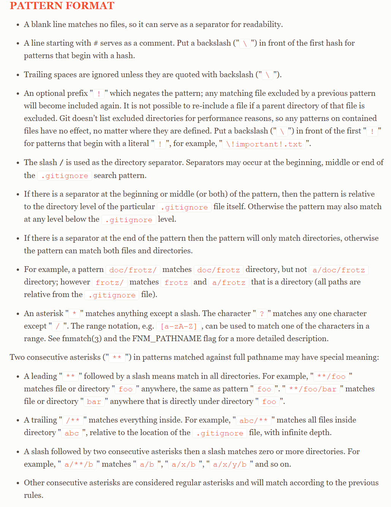
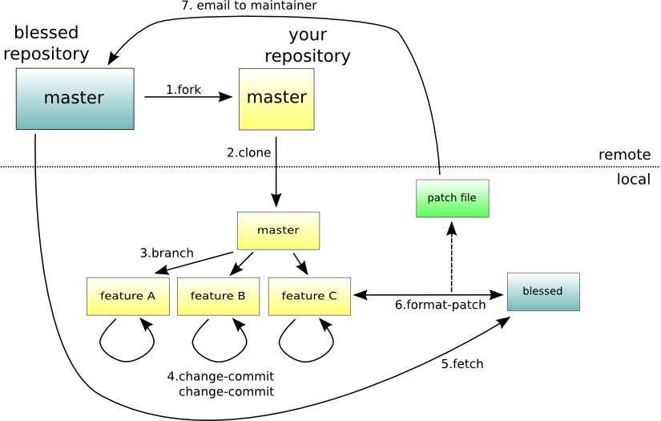
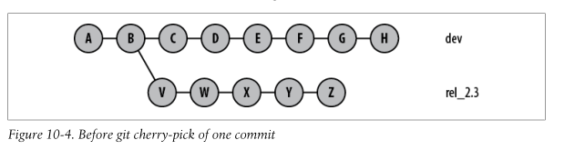
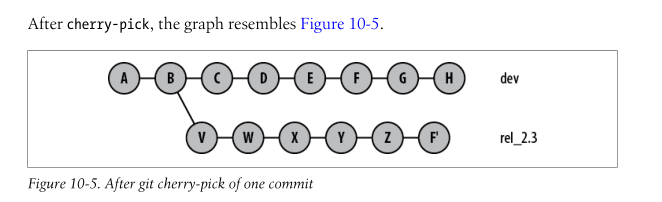

# Git FAQ

## How to write .gitignore file?

Reference: [.gitignore](https://git-scm.com/docs/gitignore) in the man pages for git



## How to remove added contents?

> [Applying .gitignore to committed files](https://stackoverflow.com/questions/7527982/applying-gitignore-to-committed-files)

```bash
git rm --cached /path/to/file
```

## What does the `fork` mean in github?

Forking is nothing more than a clone on the GitHub server side. I can push and pull from the forked repo.

More info:

[Forking vs. Branching in GitHub](https://stackoverflow.com/questions/3611256/forking-vs-branching-in-github)

## What is `git rebase`?

> [Git Branching - Rebasing](https://git-scm.com/book/en/v2/Git-Branching-Rebasing)

Just like `merge` command, `rebase` also integrate changes from one branch into another. However, git rebase makes the git tree more clean (like a linear history).


```
$ git checkout experiment
$ git rebase master
```


```
$ git checkout master
$ git merge experiment
```


Used situations:

> Often, you’ll do this to make sure your commits apply cleanly on a remote branch — perhaps in a project to which you’re trying to contribute but that you don’t maintain.

## When to use rebase and when to use merge?

> [Merging vs. Rebasing](https://www.atlassian.com/git/tutorials/merging-vs-rebasing)
>
> [When do you use Git rebase instead of Git merge?](https://stackoverflow.com/questions/804115/when-do-you-use-git-rebase-instead-of-git-merge)

- **Merge**: Let's say you have created a branch for the purpose of developing a single feature. When you want to bring those changes back to master, you probably want **merge** (you don't care about maintaining all of the interim commits).
- **Rebase**:  A second scenario would be if you started doing some development and then another developer made an unrelated change. You probably want to pull and then rebase to base your changes from the current version from the repository.

## How to rebase onto a remote branch?

> [git rebase onto remote updates](https://stackoverflow.com/questions/2916958/git-rebase-onto-remote-updates)

Use `git pull --rebase`

## How to push newly created local branch to a remote branch?

> https://blog.csdn.net/ljj_9/article/details/79386306

1. use `git branch` to check current branch;
2. `git push origin dev_luyue:dev_luyue`

## How about push a new local repository to a remote one?

> [Pushing from local repository to GitHub hosted remote](https://stackoverflow.com/questions/10573957/pushing-from-local-repository-to-github-hosted-remote)

First create a new remote repository in github.

Use the repo's url to establish local-remote repos' relationship:

```
git remote add origin git@github.com:username/reponame.git
git remote add origin https://github.com/username/reponame
```

First push:

```
git push --set-upstream origin master
```

And after all these:

```
git push
```

## How to use submodules?

> [Git Tools - Submodules](https://git-scm.com/book/en/v2/Git-Tools-Submodules)

1. What can I do with submodules?

   Submodules allow you to keep a Git repository as a subdirectory of another Git repository. 

2. How to add submodules to my git repository?

   `git sumodule add <url>`

3. What is the `.gitmodules` file?

   This is a configuration file that stores the mapping between the project’s URL and the local subdirectory you’ve pulled it into.

4. How to clone a repository with submodules?

   ```
   $ git clone <url-main-repo>
   $ git submodule init
   $ git submodule update
   # or
   $ git clone --recurse-submodules <url-main-repo>
   ```

5. Pulling in upstream changes from the remote submodule repos

   ```
   # go into the submodule's directory
   $ git fetch
   $ git merge origin/master
   # an easier way
   $ git submodule update --remote <submodule-name>
   ```


## How to merge two local branches?

> https://stackoverflow.com/questions/25053697/git-merge-two-local-branches

merge branch B into branch A:

```
git checkout branchA
git merge branchB
```

## What is patch files in git?

> https://stackoverflow.com/questions/8279602/what-is-a-patch-in-git-version-control

illustration:



Patch describes the change to the contents of a file. And it is what exactly `diff` tell us. For example, apply the patch to file1.txt according to the newly created file2.txt:

```
$ cat file1.txt 
This is line A.
This is line B, or otherwise #2.
$ cat file2.txt 
This is SPARTA.
This is line B, or otherwise #2.
$ diff -u file1.txt file2.txt > changes.patch
$ cat changes.patch 
--- file1.txt   2011-11-26 11:09:38.651010370 -0500
+++ file2.txt   2011-11-26 11:07:13.171010362 -0500
@@ -1,2 +1,2 @@
-This is line A.
+This is SPARTA.
 This is line B, or otherwise #2.
$ patch < changes.patch 
patching file file1.txt
$ cat file1.txt 
This is SPARTA.
This is line B, or otherwise #2.
```

> When talking in terms of git, patch file still means the same thing, but using diff + patch yourself would be a nightmare. For example, you will always have to have two versions of the file (or even the whole repository) checked out in order to compare them. Doesn't sound that good, does it? So git takes care of all of the hard work for you - it compares your local file with what is there in the repository you are working with, and can show it to you as a "diff", or apply that "diff" as a patch aka commit your changes, or even let you apply some patch file that you have already. 

All the stuff above introduce what patches are. How to make patch files and apply patch in git?

> https://juejin.cn/post/6844903646384095245

1. make patches:

   one commit one patch

   Make **n** patches before a certain commit (included):

   `git format-patch <sh1> -n`

   Make patches between two commits:

   `git format-patch <sh1>..<sh2> `

2. apply patches

   `git apply <path_to_patch_file> `

## About git reset

> [Git Reset](https://www.atlassian.com/git/tutorials/undoing-changes/git-reset)

`git reset` will modify the state of the three trees. The ref pointer modification always happens and is an update to the third tree, the Commit tree. The command line arguments `--soft, --mixed`, and `--hard` direct how to modify the Staging Index, and Working Directory trees.

**--hard**

The Commit History ref pointers are updated to the specified commit. Then, the Staging Index and Working Directory are reset to match that of the specified commit. 

**--mixed**

The Staging Index is reset to the state of the specified commit. Any changes that have been undone from the Staging Index are moved to the Working Directory.

**--soft**

The Staging Index and the Working Directory are left untouched. 

## About git revert

> [git revert](https://www.atlassian.com/git/tutorials/undoing-changes/git-revert)

 A revert operation will take **the specified commit**, inverse the changes from that commit, and create a new "revert commit".

**reset vs. revert**

- `git revert` undoes a single commit—it does not "revert" back to the previous state of a project by removing all subsequent commits.
- First, it doesn’t change the project history, which makes it a “safe” operation for commits that have already been published to a shared repository. 

## "Reset, restore and revert" in git

> [What's the difference between Git Revert, Checkout and Reset?](https://stackoverflow.com/questions/8358035/whats-the-difference-between-git-revert-checkout-and-reset)
>
> [Why do I get conflicts when I do git revert?](https://stackoverflow.com/questions/46275070/why-do-i-get-conflicts-when-i-do-git-revert)
>
> [Resetting, Checking Out & Reverting](https://www.atlassian.com/git/tutorials/resetting-checking-out-and-reverting)

Git revert doesn't "take you back to" that commit and pretend that subsequent commits didn't happen. It applies a logical negation of a single commit - and *that commit alone* - leaving subsequent commits in place.

An example in https://stackoverflow.com/a/46275419/11100389

Use `git reset --hard <commit>` on another branch will not affect other branches.

## How to undo unstaged and untracked files?

> [How to quickly undo staged and unstaged changes in git?](https://stackoverflow.com/questions/16160199/how-to-quickly-undo-staged-and-unstaged-changes-in-git)

Use clean command:

```
git clean -fd
```

Another method:

```
git reset HEAD # unstage all changes
git checkout . # discard all the changes
```

## What is cherry-pick in git?

> [What does cherry-picking a commit with Git mean?](https://stackoverflow.com/questions/9339429/what-does-cherry-picking-a-commit-with-git-mean)

Cherry picking in Git means to choose a commit from one branch and apply it onto another.

```
$ git checkout rel_2.3
$ git cherry-pick dev~2 # commit F, below
```

before:



after:



## How to pull a newly created remote branch to the local repo?

I worked with my colleagues on a project and he created a new branch remotely and added some new features to that branch. I wanted to pull this branch to my local repository. What is the solution?

> https://blog.csdn.net/tterminator/article/details/52225720

```
git fetch origin <remote-branch-name>:local-branch-name
```

This git command will create a new branch named local-branch-name and its content is the same with remote-branch-name.

## How to clone a specific branch

> https://stackoverflow.com/a/4568323/11100389

```
git clone -b <branch> <remote_repo>
```

The command above will fetch all the branches.

To prevent fetching all the branches, just add --single-branch

```
git clone -b opencv-2.4 --single-branch https://github.com/Itseez/opencv.git
```

## What is the difference between git pull and fetch

> [What is the difference between 'git pull' and 'git fetch'?](https://stackoverflow.com/questions/292357/what-is-the-difference-between-git-pull-and-git-fetch)

> In the simplest terms, `git pull` does a `git fetch` followed by a `git merge`.
>
> You can do a **`git fetch`** at any time to update your remote-tracking branches under `refs/remotes/<remote>/`. This operation never changes any of your own local branches under `refs/heads`, and is safe to do without changing your working copy. I have even heard of people running `git fetch` periodically in a cron job in the background (although I wouldn't recommend doing this).
>
> A **`git pull`** is what you would do to bring a local branch up-to-date with its remote version, while also updating your other remote-tracking branches.

## Git branches and merge

> http://git-scm.com/book/en/v2/Git-Branching-Basic-Branching-and-Merging

fast-forward merge and three-way merge:

> - when you try to merge one commit with a commit that can be reached by following the first commit’s history, Git simplifies things by moving the pointer forward because there is no divergent work to merge together — this is called a “fast-forward.”
> - Because the commit on the branch you’re on isn’t a direct ancestor of the branch you’re merging in, Git has to do some work. In this case, Git does a simple three-way merge, using the two snapshots pointed to by the branch tips and the common ancestor of the two.

## Resolve conflicts

1. Use `git status` to see which files are unmerged at any point after a merge conflict;

2. Open those files manually and resolve those conflicts. Run `git add` on each file to mark it as resolved. Staging the file marks it as resolved in Git.

   ```
   <<<<<<< HEAD:index.html
   <div id="footer">contact : email.support@github.com</div>
   =======
   <div id="footer">
    please contact us at support@github.com
   </div>
   >>>>>>> iss53:index.html
   ```

   Or use `git mergetool` to resolve these conflicts graphically.

3. Run `git status` again to verify that all conflicts have been resolved.

4. Commit.

## Git pull warnings

> https://stackoverflow.com/questions/62653114/how-to-deal-with-this-git-warning-pulling-without-specifying-how-to-reconcile

## What is the difference between pull request and merge request?

> [Pull request vs Merge request](https://stackoverflow.com/questions/22199432/pull-request-vs-merge-request)
>
> [Making a Pull Request](https://www.atlassian.com/git/tutorials/making-a-pull-request)

First of all, GitLab's ["merge request"](http://doc.gitlab.com/ce/api/merge_requests.html) feature is equivalent to GitHub's ["pull request"](https://help.github.com/articles/using-pull-requests/) feature. Both are means of pulling changes from another branch or fork into your branch and merging the changes with your existing code. 

Second, there are three main workflows:

- Feature Branch Workflow
- Gitflow Workflow (develop and master branch)
- Forking Workflow (the pull request’s source repository will differ from its destination repository)

## More about fetch

> [git fetch](https://www.atlassian.com/git/tutorials/syncing/git-fetch)

- Comparison 

fetch is a safer version of git pull. We can inspect the commits first and then merge them into the local repository.

- local and remote isolation 

All commits are stored in `./.git/objects`, and the refs for local branches are stored in `./.git/refs/heads`, and the refs for remote branches are stored in `./.git/refs/remotes`

- usage

1. fetch a remote branch

```
git fetch <repo_name> <origin/branch_name>
git checkout <origin/branch_name>
git checkout -b <new-branch_name>
```

2. Synchronization 

```
git fetch origin
git log --oneline main..origin/main
git checkout main
git merge origin/main
```

## git checkout and two new (2021.8) alternatives

> [New in Git: switch and restore](https://www.banterly.net/2021/07/31/new-in-git-switch-and-restore/)

True use of checkout:

`git checkout <tree-ish> -- <pathspec>`

If I am on the develop branch, `git checkout main -- test.txt` will make test file's state to the main branch's.

`git switch <branch_name>`

`git switch -d <ish>` detached head

`git switch -c <new_branch_name>` create and switch to a new branch.

`git restore -- test.txt` 

## How to untrack some tracked and added files in git?

> [How can I make Git “forget” about a file that was tracked, but is now in .gitignore?](https://stackoverflow.com/questions/1274057/how-can-i-make-git-forget-about-a-file-that-was-tracked-but-is-now-in-gitign)

Untrack a file:

`git rm --cached <file>`

Untrack a folder:

`git rm -r --cached <folder>`

## How to checkout to a remote branch?

> [How do I check out a remote Git branch?](https://stackoverflow.com/questions/1783405/how-do-i-check-out-a-remote-git-branch)

If someone push a branch to the remote repository, how can I checkout to that branch locally?

`git checkout -b test <name-of-remote>/test`

## How to show information for a specific commit (based on SHA1)?

> [Get information about a SHA-1 commit object?](https://stackoverflow.com/questions/7610073/get-information-about-a-sha-1-commit-object)

## How to delete a branch (locally and remotely)?

> [How do I delete a Git branch locally and remotely?](https://stackoverflow.com/questions/2003505/how-do-i-delete-a-git-branch-locally-and-remotely)

Use "-d" command

```bash
$ git push -d <remote_name> <branch_name>
$ git branch -d <branch_name>
```

## Git commit message rules

[Understand how to write a good commit message through memes](https://medium.com/@hritik.jaiswal/how-to-write-a-good-commit-message-9d2d533b9052)

50/72 commit message rules:

50 is the maximum number of characters of the commit title, and 72 is the maximum character length of the commit body. 

## Configure multiple users for git

> [Can I specify multiple users for myself in .gitconfig?](https://stackoverflow.com/questions/4220416/can-i-specify-multiple-users-for-myself-in-gitconfig)

One useful situation: one account for personal github account and one for working using company account.

From the root of a specific repo (will override the global configuration):

```bash
git config user.name "Your Name Here"
git config user.email your@email.com
```

Default users:

```bash
git config --global user.name "Your Name Here"
git config --global user.email your@email.com
```

More about git config:

> https://www.atlassian.com/git/tutorials/setting-up-a-repository/git-config#:~:text=The%20git%20config%20command%20is,modify%20a%20configuration%20text%20file

## Resources

- [git control from missing semeter](https://missing.csail.mit.edu/2020/version-control/)

> git cat-file -p <hash_number>: to read the content ( or blob ) of a git object
>
> git log --all --graph --decorate: show git graphical logs
>
> git checkout \<hash\>: forward or backward
>
> git diff \<hash\> <file_name>: show a specific file's difference between the commit and current position
>
> git merge --continue: resolve conflicts and do continuely merge

- Some articles

> [git 基本原理介绍](https://mp.weixin.qq.com/s/WvAhPoPVrB1ide1FzqSsGQ)

