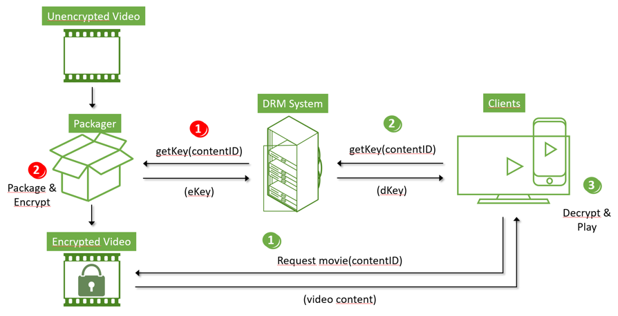

# Stuffs from Streaming Onboarding

> https://github.com/Eyevinn/streaming-onboarding

## Adaptive Bit-rate Streaming

> [How video works](https://howvideo.works/)
>
> [Internet Video Streaming — ABR part 1](https://medium.com/@eyevinntechnology/internet-video-streaming-abr-part-1-b10964849e19)
>
> [Internet Video Streaming — ABR part 2](https://medium.com/@eyevinntechnology/internet-video-streaming-abr-part-2-dbce136b0d7c)
>
> [Internet Video Streaming — ABR part 3](https://medium.com/@eyevinntechnology/internet-video-streaming-abr-part-3-45ff4bb3d436)

### What is ABR?

播放器（player）自适应的选择分辨率与比特率呈现给用户。例如在观看youtube时，网络状况不佳时，分辨率暂时下降，后恢复。

### HTTP Live Streaming (HLS)

将视频文件分割为多块（每块时长在2~12秒，每块对应一个.ts文件），每个分辨率下都分块，形成不同的profiles。视频播放过程中，使用带宽估计算法，自适应的选择profile对应时段播放。

### Manifest Files

一个主配置文件辅以多个rendition manifests。主配置文件告诉播放器每个rendition的信息，加载（自适应选择）对应的rendition manifest，加载对应的时段。

### DASH

与HLS基本相同，所不同在于manitest采用的是xml文件，同时找寻分段的方式不同。DASH和HLS都是基于HTTP协议。

### 播放器的两种选择

>  (1) Buffer, meaning pause the video and show a loading spinner and make you wait while it downloads more segments or (2) Degrade to a lower resolution so you can keep watching. 

### 渐进式下载

例如MP4 & WebM格式，不支持ABS，以边下载边播方的方式给用户呈现视频。

> Most players will also allow you to drag the playhead to specific places in the video timeline and the player will use byte-range requests to estimate which part of the file corresponds to the place in the video you are attempting to seek.

### 视频的传输存储

CDN: content delivery network. 

> As for the system that’s responsible for delivering that content, there are two primary components: the origin server and the content delivery network (CDN).
>
> a CDN is a system of interconnected servers located across the globe that uses geographical proximity as the main criteria for distributing cached content (e.g. segmented video files) to viewers. When a viewer requests content from their device (i.e. clicks a video play button), the request is routed to the closest server in the content delivery network.

即以分布式的方式与用户端通信。对视频的首次获取要通过原始服务器，后续获取通过CDN的本地缓存。

### 推流与拉流

> So push based streaming is initiated by a transmitter while pull based streaming is initiated by the playing device, or by the consumer.

显然，基于ABR的是拉流。

### 支持ABR的格式

HLS, HDS, MSS, MPEG-DASH, etc.

### ABR缺点

- 需要存储多个profiles;

- HTTP协议不够轻量级——QUIC

- 高延迟 (latency)——Chunk Transfer encoding；

- 多种格式，兼容性——fly repackaging

  > The Fly repackaging. Content is stored in a common file format on disk and repackaged (and encrypted) on the fly for each received client request. Depending on how many formats that are used on the fly repackaging saves at least 50% storage.

## Securing OTT Content

### What is OTT content?

> https://en.wikipedia.org/wiki/Over-the-top_media_service

An over-the-top (OTT) media service is a media service offered directly to viewers via the Internet. 

### Four ways to protect OTT content

> https://eyevinntechnology.medium.com/securing-ott-content-a941d998ca9a

1. Tokens: When a client request is received by a server, the incoming token is validated the originating request, i.e. preventing URL sharing, tampering or other changes. When a client player browses the video portal and selects a piece of content, it is being redirected to a content specific URL.
2. HTTPS
3. DRM-Digital Rights Management: DRM includes the distribution of encryption and decryption keys, backend licensing servers with various functionalities such as policy control and offline playback control.
4. Watermark.

### Watermarking

> https://eyevinntechnology.medium.com/securing-ott-content-watermarking-7d2b494f725f

1. Visual Watermarking
2. Forensic Watermarking
3. A/B watermarking
4. Bitstream based forensic watermarking.

### DRM

> https://eyevinntechnology.medium.com/securing-ott-content-drm-1af2c08fdd31

- what is DRM?

   DRM includes the distribution of encryption and decryption keys, backend licensing servers with various functionalities such as policy control and offline playback control. 

- The DRM workflow

   DRM is applied for encrypting the content in the packager (steps 1–2 marked red), and where the client uses the DRM for decrypting the content (steps 1–3 marked green).

