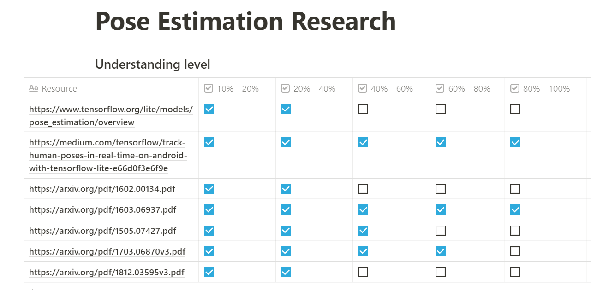

# Blogs and Articles Reading

## Technology Views

### [Teach Yourself Programming in Ten Years](http://norvig.com/21-days.html)

**A little learning is a dangerous thing**. It takes about ten years to develop expertise in any of a wide variety of areas, including chess playing, music composition, telegraph operation, painting, piano playing, swimming, tennis, and research in neuropsychology and topology. The key is deliberative practice: **not just doing it again and again, but challenging yourself with a task that is just beyond your current ability**, trying it, analyzing your performance while and after doing it, and correcting any mistakes. Then repeat. And repeat again.

### [How You Should Read Research Papers According To Andrew Ng](https://towardsdatascience.com/how-you-should-read-research-papers-according-to-andrew-ng-stanford-deep-learning-lectures-98ecbd3ccfb3)

这篇文章干货很多，近期在medium上罕见的好文章。主要根据吴恩达关于[如何阅读科研文章的讲座](https://www.youtube.com/watch?v=733m6qBH-jI)撰写的笔记和个人认识。

1. 读完一篇文章后应该问自己：

   1. If a new approach/technique/method was introduced in a paper, what are the key elements of the newly proposed approach?
   2. What content within the paper is useful to you?
   3. What other references do you want to follow?

2. 关于一个课题收集到了大量的文献，可以制作一个阅读进度表，如下图：

   

## Careers

### [Facebook副总裁：给近百人做职业辅导，我发现了职业跃迁的秘密](https://mp.weixin.qq.com/s/PTaZex-bvbVb-0DjcCC3Rw)

- 在Nikhyl看来，选择一家公司，除了要考虑金钱、空间、共事的同事之外，更重要的是要去**考量这家公司正处于什么阶段，这个阶段是不是跟自己的能力和状态相匹配**。
- 当你面对职业发展下一站的选择时，首要考虑的要素应该是去哪个发展阶段的公司发展，如果我们把公司的发展阶段分为：产品探索前期——找到产品市场适配期——增长期——规模化发展四个阶段，对于一个有方向性的职业发展需求，一般只会在某一或二个发展阶段找到适配。

### [The risks you can't foresee](https://hbr.org/2020/11/the-risks-you-cant-foresee)

哈佛商业评论上的一篇文章，主要讲公司的危机预见与处理，感觉同样适合于个人。

1. 不要一次性加太多features，波音的反例：

   > “We made too many changes at the same time—new technology, new design tools, and a change in the supply chain—and thus outran our ability to manage it effectively.”

2. 对事物的认知偏差导致陷入危机：

   > Failures to pick up signals are rooted in **well-documented biases**. Decades of behavioral research show that **people pay attention to information that confirms their beliefs but disregard it when it conflicts with them.** They often dismiss repeated deviances and near misses as mere blips. This “normalization of deviance” gets reinforced by groupthink, which causes team leaders to suppress or ignore concerns and anomalies reported by lower-level personnel.

3. 发现危机的最基本原则

   > The bottom line is that recognizing a novel risk requires people to suppress their instincts, question their assumptions, and think deeply about the situation. 

## On Writing Well

### [Writing tools I learned from The Economist](https://builtbywords.substack.com/p/writing-tools-i-learned-from-the)

- I’d divide each issue into two units: **New Vocabulary** and **Writing Tools**. I’d then memorize the novel words and apply the newly-discovered sentence structures to my essays. I kept doing this for three years.
- 主题鲜明：Scattered evidence, like objects in a spacious room, gives readers the impression they’re approaching a weak argument.

## How to Learn

### [Advice for Young Scientists-and Curious People in General](https://fs.blog/2021/05/advice-for-young-scientists/)

> - “As there is no knowing in advance where a research enterprise may lead and what kind of skills it will require as it unfolds, this process of ‘equipping oneself’ has no predeterminable limits and is bad psychological policy….The great incentive to learning a new skill or supporting discipline is needing to use it.”

- **Reading becomes counterproductive** when it serves as a substitute for doing the real thing, if that’s what someone is reading for. 
- The best scientists begin with the understanding that they can never know anything and, besides, learning needs to be a lifelong process.

### By Sherlock Holmes

"I consider that a man’s brain originally is like a little empty attic, and you have to stock it with such furniture as you choose. **A fool takes in all the lumber of every sort that he comes across, so that the knowledge which might be useful to him gets crowded out, or at best is jumbled up with a lot of other things so that he has a difficulty in laying his hands upon it.**"

— Sherlock Holmes, A Study in Scarlet

### [The 40/60 Rule: A Real-World Secret to Mastering Any New Skill](https://medium.com/personal-growth/the-40-60-rule-a-real-world-secret-to-mastering-any-new-skill-87dce92bf200)

- For a lot of skills, it’s much better to spend about two thirds of your time testing yourself on it rather than absorbing it.
- Reading or listening to best practices is only valuable if you start doing or applying that knowledge. 

